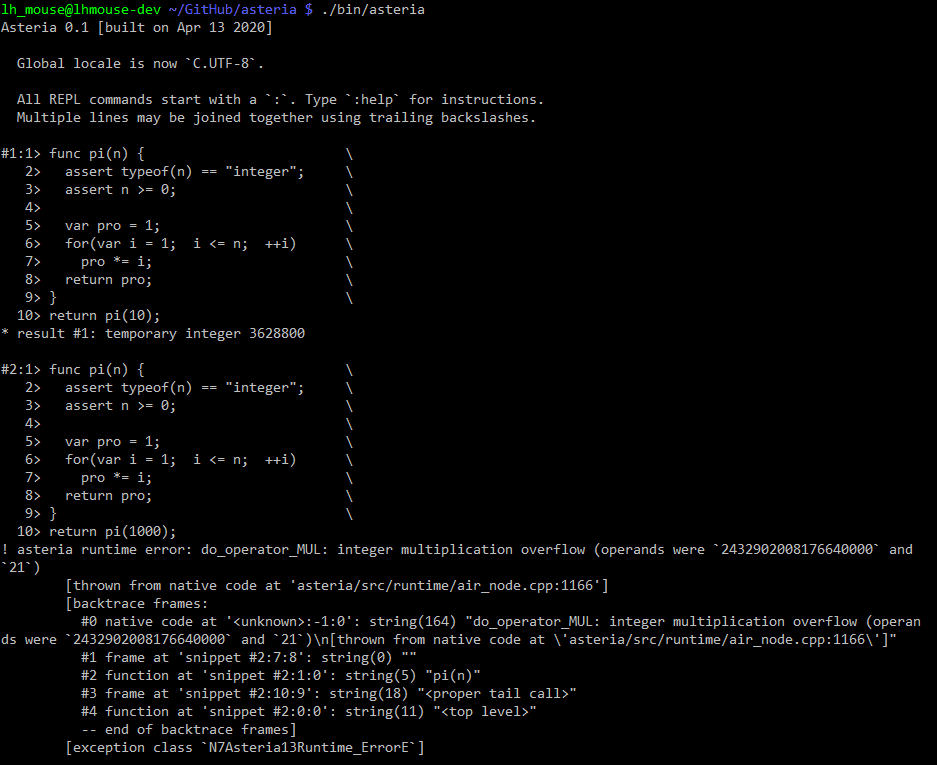

# The Asteria Programming Language

|Compiler     |Category                   |
|:------------|:--------------------------|
|**GCC 7**    |:1st_place_medal:Primary   |
|**Clang 11** |:2nd_place_medal:Secondary |


**Asteria** is a procedural, dynamically typed programming language that is
highly inspired by JavaScript but has been designed to address its issues.

* [Quick Guide](doc/quick-guide.md)
* [Production Rules](doc/grammar.txt)
* [Operator Precedence](doc/operator-precedence.txt)
* [Standard Library Reference](doc/standard-library.md)
* [Highlighting Rules for GNU nano](doc/asteria.nanorc)

# How to Build

First, you need to install some dependencies and an appropriate compiler,
which can be done with

```sh
# For Debian, Ubuntu, Linux Mint:
# GCC 9+ is generally recommended. If you don't have it in your APT sources,
# try <https://launchpad.net/~ubuntu-toolchain-r/+archive/ubuntu/ppa>.
sudo apt-get install  \
  autoconf automake libtool g++ gettext make  \
  libpcre2-dev libssl-dev zlib1g-dev libedit-dev
```
```sh
# For MSYS2 on Windows:
# The `iconv_open()` etc. functions are provided by libiconv. Only the MSYS
# shell is supported. Do not try building in the MINGW64 or UCRT64 shell.
pacman -S  \
  autoconf automake libtool gcc gettext make  \
  pcre2-devel openssl-devel zlib-devel libiconv-devel libedit-devel
```
```sh
# For macOS:
# The `gcc` command actually denotes Clang, so you need to ask for a specific
# version of GCC explicitly.
brew install  \
  autoconf automake libtool gcc@10 gettext make  \
  pcre2 openssl@3 zlib libedit

export CXX='g++-10 -I/usr/local/include -L/usr/local/lib'
```

Then we can configure and build, as usual

```sh
autoreconf -i
./configure
make -j$(nproc)
```

Finally we launch the REPL, as

```sh
./bin/asteria
```



If you need only the library and don't want to build the REPL, you may omit
`libedit` from the dependencies above, and pass `--disable-repl` to
`./configure`.

# License

BSD 3-Clause License
